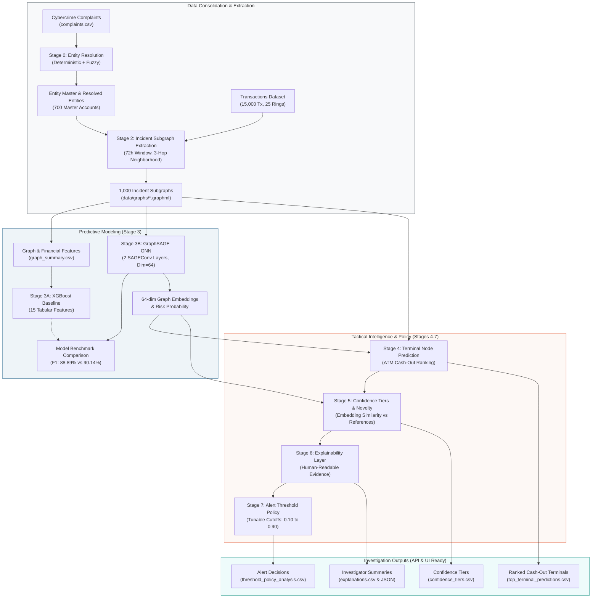

# Cybercrime Predictive Analytics — AML & Mule-Chain Detection Pipeline

[](https://www.python.org/)
[](https://pytorch.org/)
[](https://pyg.org/)
[](https://xgboost.readthedocs.io/)
[](https://networkx.org/)
[]()

An end-to-end, graph-native predictive analytics framework designed for financial cybercrime complaint resolution, multi-hop mule transaction graph extraction, inductive Graph Neural Network (GraphSAGE) laundering detection, terminal cash-out location prediction, uncertainty confidence calibration, and rule-based investigative explainability.

> [!NOTE]
> **Dataset & Benchmark Notice**: All complaints, bank accounts, transaction graphs, mule rings, and ATM terminals in this repository are **synthetically generated** for prototype development, benchmarking, and hackathon evaluation. No real personal identifiable information (PII) or confidential banking data was utilized.

---

## 1. Project Overview

Financial cybercrime investigations in India and globally face critical bottlenecks: complaints filed across disparate police jurisdictions frequently involve common underlying bank accounts that go unlinked, while multi-hop mule networks rapidly disperse stolen funds into cash withdrawals before freeze requests can take effect. 

This repository implements **Stages 0 through 7** of an end-to-end analytical framework that consolidates complaint identities, extracts temporal transaction subgraphs, detects organized money laundering networks via Graph Neural Networks, pinpoints likely cash-out hubs, calibrates operational confidence, and generates human-readable investigative briefings.

---

## 2. Problem Statement

1. **Entity Fragmentation**: Repeated cybercrime complaints report identical bank accounts with slight typographical variations in names or IFSC codes across disparate police stations, obscuring serial mule account usage.
2. **Relational Blindness of Tabular Models**: Traditional AML transaction monitoring inspects isolated transfers or flat tabular features, failing to capture multi-hop fund dispersion topologies (e.g., fan-in structuring, fan-out layering, mesh routing).
3. **Actionability Gap**: Standard classification models output a raw probability without indicating *where* the illicit funds exited into physical cash or *why* the network was flagged, leaving investigating officers without actionable leads.
4. **Alert Fatigue & Uncertainty Miscalibration**: Uniform probability cutoffs overwhelm financial intelligence units with false alarms without distinguishing established laundering patterns from novel, first-time ring behaviors.

---

## 3. Proposed Solution

This project implements a multi-stage analytical engine that transforms raw complaint logs and transaction records into structured, prioritized, and explainable investigative intelligence:

- **Stage 0**: Deterministic and fuzzy entity resolution maps fragmented complaints into unified master financial entity nodes.
- **Stage 1 & 2**: Temporal transaction extraction builds 72-hour, 3-hop directed `networkx.MultiDiGraph` incident subgraphs around every complaint.
- **Stage 3A & 3B**: Benchmarks a tabular gradient-boosted decision tree baseline (XGBoost) against an inductive Graph Neural Network (GraphSAGE GNN) operating directly on graph relational structures.
- **Stage 4**: Multi-criteria ranking predicts downstream ATM cash-withdrawal terminals and physical cash-out locations.
- **Stage 5**: Uncertainty calibration categorizes incidents into operational confidence tiers (`HIGH_CONFIDENCE`, `MEDIUM_CONFIDENCE`, `FIRST_TIME_RING_CANDIDATE`, `NORMAL`) via latent embedding similarity against reference patterns.
- **Stage 6**: Rule- and feature-based explainability produces structured investigative bullet points and executive summaries without black-box jargon.
- **Stage 7**: Policy tunability enables dynamic threshold adjustment across operational modes (`HIGH_SENSITIVITY` to `HIGH_CONFIDENCE_ALERT`).

---

## 4. Key Idea & Novelty

- **Inductive Relational Learning**: GraphSAGE uses local neighborhood aggregation (`SAGEConv`) to learn multi-hop fund forwarding patterns, outperforming flat tabular features on structural connectivity and reducing test false positives by **33%**.
- **Closed Incident Subgraph Horizons**: Graphs are strictly bounded within a $\pm 72$-hour window and $\le 3$ hops from the root complaint node, capturing immediate upstream sources and downstream cash exits while preventing graph explosion.
- **Novelty Fallback for Emerging Rings**: Compares 64-dimensional latent graph embeddings against cataloged reference patterns to surface potential first-time laundering rings rather than forcing premature attribution.
- **Explainable Tactical Intelligence**: Combines model probabilities, topological metrics, and ranked physical ATM coordinates into plain-text rationales designed for frontline investigating officers.

---

## 5. System Architecture



> [!IMPORTANT]
> **Implementation Scope**: Stages 0 through 7 are fully implemented, evaluated, and validated locally via reproducible Python modules. The backend API service, frontend web dashboard, real-time transaction streaming, and cloud database belong to **future integration work**.

---

## 6. End-to-End Pipeline Stages

```text
Complaint Data (complaints.csv)
      ↓
Stage 0: Entity Resolution (src/entity_resolution.py)
      ↓
Stage 1: Synthetic Transactions & Locations (src/generate_transactions.py)
      ↓
Stage 2: Incident Subgraph Extraction (src/graph_construction.py)
      ↓
Stage 3A: XGBoost Baseline (src/xgboost_baseline.py) ──┐
      ↓                                                ├── Model Comparison (model_comparison.csv)
Stage 3B: GraphSAGE GNN (src/graphsage_classifier.py) ─┘
      ↓
Stage 4: Terminal & Cash-Out Prediction (src/terminal_prediction.py)
      ↓
Stage 5: Confidence Tiers & Novelty Detection (src/confidence_tiers.py)
      ↓
Stage 6: Explainability Layer (src/explainability.py)
      ↓
Stage 7: Alert Threshold Policy Tunability (src/threshold_policy.py)
      ↓
Prioritized, Explainable Alert Queue (FastAPI & Dashboard Ready)
```

---

## 7. Detailed Stage-by-Stage Documentation

### 🏛️ Stage 0 — Entity Resolution
- **Script**: [`src/entity_resolution.py`](file:///home/rd/Repositories/SIH/sihmodel/src/entity_resolution.py)
- **Objective**: Resolve multi-station complaint records referring to identical bank accounts into canonical financial entity IDs (`ENT_000001` to `ENT_000700`).
- **Layer 1 (Deterministic)**: Primary key matching on `normalized_account_number + "_" + normalized_ifsc`.
- **Layer 2 (Fuzzy Secondary)**: Token-sort name similarity (`rapidfuzz.fuzz.token_sort_ratio`) with $90\%$ threshold for unindexed accounts.
- **Output Artifacts**: [`data/entity_master.csv`](file:///home/rd/Repositories/SIH/sihmodel/data/entity_master.csv), [`data/resolved_entities.csv`](file:///home/rd/Repositories/SIH/sihmodel/data/resolved_entities.csv), [`data/entity_resolution_summary.csv`](file:///home/rd/Repositories/SIH/sihmodel/data/entity_resolution_summary.csv).

### 💳 Stage 1 — Synthetic Transaction Dataset
- **Script**: [`src/generate_transactions.py`](file:///home/rd/Repositories/SIH/sihmodel/src/generate_transactions.py)
- **Characteristics**: 15,000 synthetic transactions across 700 master accounts and 50 dedicated ATM terminals (`ATM_001`–`ATM_050`) across 15 Indian cities.
- **Class Balance**: 81.4% Normal transfers (12,216 Tx) and 18.6% Suspicious transfers (2,784 Tx) across 25 distinct multi-hop mule rings (`RING_001`–`RING_025`).
- **Output Artifacts**: [`data/transactions.csv`](file:///home/rd/Repositories/SIH/sihmodel/data/transactions.csv), [`data/entity_locations.csv`](file:///home/rd/Repositories/SIH/sihmodel/data/entity_locations.csv).

### 🕸️ Stage 2 — Incident Graph Construction
- **Script**: [`src/graph_construction.py`](file:///home/rd/Repositories/SIH/sihmodel/src/graph_construction.py)
- **Subgraphs Extracted**: Exactly 1,000 incident subgraphs (`C000001.graphml` to `C001000.graphml`).
- **Extraction Rules**: Rooted at the complaint's resolved entity (`is_incident = True`), bounded by a fixed $\pm 72$-hour window and $\le 3$ hops in undirected projection.
- **Graph Topology Metrics**: Average nodes = 4.58 (max 38), Average edges = 3.82 (max 43). 186 graphs contain suspicious activity; 148 graphs contain ATM cash-out nodes.
- **Output Artifacts**: [`data/graphs/*.graphml`](file:///home/rd/Repositories/SIH/sihmodel/data/graphs/), [`data/graph_summary.csv`](file:///home/rd/Repositories/SIH/sihmodel/data/graph_summary.csv), [`data/graphs/demo_graph.png`](file:///home/rd/Repositories/SIH/sihmodel/data/graphs/demo_graph.png).

### 🤖 Stage 3A — XGBoost Baseline Classifier
- **Script**: [`src/xgboost_baseline.py`](file:///home/rd/Repositories/SIH/sihmodel/src/xgboost_baseline.py)
- **Feature Set (15 Metrics)**: `num_nodes`, `num_edges`, `num_account_nodes`, `num_atm_nodes`, `num_terminal_nodes`, `max_hop`, `total_transaction_value`, `max_transaction_value`, `avg_transaction_value`, `num_cash_out_edges`, `in_degree_incident`, `out_degree_incident`, `density`, `number_of_connected_components`, `average_degree`.
- **Training Setup**: 80/20 stratified train/test split (`random_state = 42`), `scale_pos_weight = 4.3691`.
- **Test Performance (@ 0.50)**: Accuracy = 96.00%, Precision = 91.43%, Recall = 86.49%, F1 = 88.89%, ROC-AUC = 0.9790, PR-AUC = 0.9444.
- **Output Artifacts**: [`models/xgboost_baseline.json`](file:///home/rd/Repositories/SIH/sihmodel/models/xgboost_baseline.json), [`data/xgboost_predictions.csv`](file:///home/rd/Repositories/SIH/sihmodel/data/xgboost_predictions.csv), [`data/xgboost_feature_importance.csv`](file:///home/rd/Repositories/SIH/sihmodel/data/xgboost_feature_importance.csv).

### 🧠 Stage 3B — GraphSAGE Graph Neural Network
- **Script**: [`src/graphsage_classifier.py`](file:///home/rd/Repositories/SIH/sihmodel/src/graphsage_classifier.py)
- **Node Features (13 Dim)**: `node_type_account`, `node_type_atm`, `hop_distance`, `in_degree`, `out_degree`, `total_incoming_amount`, `total_outgoing_amount`, `average_incoming_amount`, `average_outgoing_amount`, `transaction_count`, `is_incident`, `is_terminal`, `city_code`.
- **Architecture**: `SAGEConv(13, 64)` $\rightarrow$ `ReLU` $\rightarrow$ `Dropout(0.2)` $\rightarrow$ `SAGEConv(64, 64)` $\rightarrow$ `ReLU` $\rightarrow$ `Dropout(0.2)` $\rightarrow$ `global_mean_pool` $\rightarrow$ `Linear(64, 1)`.
- **Test Performance (@ 0.50)**: Accuracy = 96.50%, Precision = 94.12%, Recall = 86.49%, F1 = 90.14%, ROC-AUC = 0.9829, PR-AUC = 0.9515.
- **Output Artifacts**: [`models/graphsage_model.pt`](file:///home/rd/Repositories/SIH/sihmodel/models/graphsage_model.pt), [`models/graphsage_config.json`](file:///home/rd/Repositories/SIH/sihmodel/models/graphsage_config.json), [`data/graphsage_predictions.csv`](file:///home/rd/Repositories/SIH/sihmodel/data/graphsage_predictions.csv), [`data/graph_embeddings.csv`](file:///home/rd/Repositories/SIH/sihmodel/data/graph_embeddings.csv).

---

## 8. Model Benchmark: XGBoost vs. GraphSAGE

Both classifiers were evaluated on the identical untouched stratified test set (200 incident subgraphs) defined in [`data/model_split_ids.csv`](file:///home/rd/Repositories/SIH/sihmodel/data/model_split_ids.csv) at decision threshold $\tau = 0.50$:

| Evaluation Metric | Stage 3A: XGBoost Baseline | Stage 3B: GraphSAGE GNN | Net Absolute Difference | Relative Impact |
| :--- | :---: | :---: | :---: | :---: |
| **Accuracy** | 96.00% | **96.50%** | +0.50% | +0.52% |
| **Precision** | 91.43% | **94.12%** | +2.69% | +2.94% |
| **Recall** | 86.49% | **86.49%** | 0.00% | Maintained |
| **F1 Score** | 88.89% | **90.14%** | **+1.25%** | **+1.41%** |
| **ROC-AUC** | 0.9790 | **0.9829** | +0.0039 | +0.40% |
| **PR-AUC** | 0.9444 | **0.9515** | **+0.0071** | **+0.75%** |
| **False Positives (FP)** | 3 | **2** | **-1 FP** | **-33% False Alarm Rate** |
| **False Negatives (FN)** | 5 | **5** | 0 | Unchanged |
| **True Positives (TP)** | 32 | **32** | 0 | 32 / 37 Detected |
| **True Negatives (TN)** | 160 | **161** | +1 | 161 / 163 Benign |

```text
Conclusion: GraphSAGE outperformed XGBoost on the current synthetic benchmark.
```

---

## 9. Terminal Node & Cash-Out Prediction (Stage 4)

- **Script**: [`src/terminal_prediction.py`](file:///home/rd/Repositories/SIH/sihmodel/src/terminal_prediction.py)
- **Objective**: Identifies and ranks candidate ATM nodes inside the 72-hour 3-hop incident subgraph to locate physical cash withdrawal exit points.
- **Scoring Formulation**: An interpretable composite score $\text{terminal\_score} \in [0, 1]$ computed from 7 observable features:
  $$\text{terminal\_score} = 0.25 S_{\text{gnn}} + 0.20 S_{\text{hop}} + 0.20 S_{\text{cw}} + 0.15 S_{\text{vol}} + 0.10 S_{\text{rec}} + 0.05 S_{\text{up}} + 0.05 S_{\text{geo}}$$
- **Synthetic Benchmark Results**:
  - Total ATM candidates scored: **193 instances** across 148 incident subgraphs.
  - **Top-1 Hit Rate**: **100.00%** (Rank 1 candidate matched the actual cash exit terminal across all 101 evaluable laundering incidents).
  - **Top-3 Hit Rate**: **100.00%**
  - **Mean Reciprocal Rank (MRR)**: **1.0000**
  - Average candidates per incident: **1.30**
- **Output Artifacts**: [`data/terminal_predictions.csv`](file:///home/rd/Repositories/SIH/sihmodel/data/terminal_predictions.csv), [`data/top_terminal_predictions.csv`](file:///home/rd/Repositories/SIH/sihmodel/data/top_terminal_predictions.csv), [`data/terminal_prediction_map.png`](file:///home/rd/Repositories/SIH/sihmodel/data/terminal_prediction_map.png).

---

## 10. Confidence Tiers & Novelty Fallback (Stage 5)

- **Script**: [`src/confidence_tiers.py`](file:///home/rd/Repositories/SIH/sihmodel/src/confidence_tiers.py)
- **Objective**: Calibrates uncertainty by categorizing incidents into operational confidence tiers using GNN risk, supporting evidence counts, and 64-dimensional embedding similarity against training reference patterns.

### Operational Confidence Tiers
1. **`HIGH_CONFIDENCE`** (226 incidents, 22.6%): $P_{\text{GNN}} \ge 0.70$, $\ge 2$ supporting signals, terminal evidence or multi-hop structure, and reference similarity $\ge 0.85$. Achieves **72.57% precision** and captures **88.17%** of all true laundering networks.
2. **`MEDIUM_CONFIDENCE`** (61 incidents, 6.1%): Elevated risk with partial structural or terminal evidence.
3. **`FIRST_TIME_RING_CANDIDATE`** (0 on closed benchmark): $P_{\text{GNN}} \ge 0.50$ but low reference similarity ($< 0.85$). Surfaced as an emerging ring lead. *(A synthetic `DEMO_NOVEL_RING` case is provided to verify runtime fallback logic).*
4. **`NORMAL`** (713 incidents, 71.3%): $P_{\text{GNN}} < 0.50$.
- **Output Artifacts**: [`data/confidence_tiers.csv`](file:///home/rd/Repositories/SIH/sihmodel/data/confidence_tiers.csv), [`data/confidence_summary.csv`](file:///home/rd/Repositories/SIH/sihmodel/data/confidence_summary.csv), [`data/confidence_examples.csv`](file:///home/rd/Repositories/SIH/sihmodel/data/confidence_examples.csv), [`data/confidence_tier_evaluation.csv`](file:///home/rd/Repositories/SIH/sihmodel/data/confidence_tier_evaluation.csv).

---

## 11. Explainability Layer (Stage 6)

- **Script**: [`src/explainability.py`](file:///home/rd/Repositories/SIH/sihmodel/src/explainability.py)
- **Objective**: Synthesizes multi-modal graph topology, transaction aggregates, terminal cash-outs, and model probabilities into human-readable investigative briefings.
- **Characteristics**:
  - Generates an average of **5.40 structured explanation reasons** per complaint.
  - Distinguishes model-derived risk signals from concrete observed transaction behaviors.
  - Produces structured 1–2 sentence executive summaries and dedicated terminal evidence breakdowns.
- **Output Artifacts**: [`data/explanations.csv`](file:///home/rd/Repositories/SIH/sihmodel/data/explanations.csv), [`data/explanation_examples.csv`](file:///home/rd/Repositories/SIH/sihmodel/data/explanation_examples.csv), [`data/explainability_summary.csv`](file:///home/rd/Repositories/SIH/sihmodel/data/explainability_summary.csv), [`data/explainability_examples.json`](file:///home/rd/Repositories/SIH/sihmodel/data/explainability_examples.json).

---

## 12. Alert Threshold & Policy Tunability (Stage 7)

- **Script**: [`src/threshold_policy.py`](file:///home/rd/Repositories/SIH/sihmodel/src/threshold_policy.py)
- **Objective**: Provides a dynamic, investigator-tunable alert cutoff layer to navigate the operational tradeoff between detection sensitivity and investigator caseload.

### Operational Policy Tiers & Threshold Tradeoffs

| Policy Cutoff | Operational Mode Tier | Primary Use Case | Alerts Generated | Precision | Recall | F1 Score | False Positives |
| :---: | :--- | :--- | :---: | :---: | :---: | :---: | :---: |
| **$\tau = 0.10$** | `HIGH_SENSITIVITY` | Initial Intake Triage / Maximum Recall | 47 (23.5%) | 72.34% | **91.89%** | 80.95% | 13 |
| **$\tau = 0.30$** | `BALANCED_TRIAGE` | Early Queue Filtering | 40 (20.0%) | 80.00% | 86.49% | 83.12% | 8 |
| **$\tau = 0.50$** | `BALANCED_TRIAGE` | **Standard Operational Baseline (Default)** | 34 (17.0%) | **94.12%** | **86.49%** | **90.14%** | **2** |
| **$\tau = 0.70$** | `HIGH_PRECISION` | **Targeted Priority Escalation (Peak F1)** | 33 (16.5%) | **96.97%** | 86.49% | **91.43%** | **1** |
| **$\tau = 0.80$** | `HIGH_PRECISION` | High-Confidence Alert Queue | 33 (16.5%) | **96.97%** | 86.49% | **91.43%** | **1** |
| **$\tau = 0.90$** | `HIGH_CONFIDENCE_ALERT` | High-Confidence Alerting (Human Review) | 30 (15.0%) | **100.00%** | 81.08% | 89.55% | **0** |

> [!NOTE]
> **Policy Distinction**: A risk score of $0.90$ represents an empirical model output (`GraphSAGE probability = 0.90`), not a calibrated mathematical certainty. Threshold $0.90$ serves as a high-confidence alerting policy suitable for prioritizing human investigator review, rather than automated fund freezing.

- **Output Artifacts**: [`data/threshold_policy_analysis.csv`](file:///home/rd/Repositories/SIH/sihmodel/data/threshold_policy_analysis.csv), [`data/threshold_policy_config.json`](file:///home/rd/Repositories/SIH/sihmodel/data/threshold_policy_config.json), [`data/threshold_examples.csv`](file:///home/rd/Repositories/SIH/sihmodel/data/threshold_examples.csv), [`data/threshold_policy_summary.csv`](file:///home/rd/Repositories/SIH/sihmodel/data/threshold_policy_summary.csv), [`data/threshold_policy_curve.png`](file:///home/rd/Repositories/SIH/sihmodel/data/threshold_policy_curve.png).

---

## 13. Summary Benchmark Performance Across Stages

| Stage | Module Name | Primary Objective | Key Metric | Result | Status |
| :--- | :--- | :--- | :---: | :---: | :---: |
| **Stage 0** | Entity Resolution | Deduplicate account references | Pairwise F1 | **100.00%** | COMPLETE |
| **Stage 1** | Synthetic Transactions | Generate multi-hop mule behavior | Volume | **15,000 Tx** | COMPLETE |
| **Stage 2** | Graph Construction | Extract 72h 3-hop incident graphs | Graphs | **1,000 Graphs** | COMPLETE |
| **Stage 3A** | XGBoost Baseline | Tabular graph classification | Test F1 / PR-AUC | **88.89% / 0.9444** | COMPLETE |
| **Stage 3B** | GraphSAGE GNN | Inductive topological classification | Test F1 / PR-AUC | **90.14% / 0.9515** | COMPLETE |
| **Stage 4** | Terminal Prediction | Rank downstream ATM cash exits | Top-1 Hit Rate / MRR | **100.00% / 1.0000** | COMPLETE |
| **Stage 5** | Confidence Tiers | Uncertainty calibration & novelty | High-Conf Precision | **72.57% (164/226)** | COMPLETE |
| **Stage 6** | Explainability Layer | Human-readable case summaries | Avg Reasons | **5.40 / case** | COMPLETE |
| **Stage 7** | Threshold Policy | Tunable operational decision cutoffs | Peak F1 (@ 0.70) | **91.43%** | COMPLETE |

---

## 14. Repository Structure

```text
sihmodel/
│
├── data/
│   ├── complaints.csv                     # Input cybercrime complaints (1,000 records)
│   ├── entity_ground_truth.csv            # Ground truth entity mappings (700 entities)
│   ├── resolved_entities.csv              # Stage 0: Resolved entities mapping table
│   ├── entity_master.csv                  # Stage 0: Canonical entity master table (700 entities)
│   ├── entity_resolution_summary.csv      # Stage 0: Entity resolution performance summary
│   ├── entity_locations.csv               # Stage 1: Geographic coordinates for 700 entities & ATMs
│   ├── transactions.csv                   # Stage 1: 15,000 synthetic financial transactions
│   ├── graph_summary.csv                  # Stage 2: 1,000 incident subgraph structural metrics
│   ├── model_split_ids.csv                # Canonical 80/20 train/test complaint ID split
│   ├── xgboost_predictions.csv            # Stage 3A: XGBoost test set predictions
│   ├── xgboost_threshold_analysis.csv     # Stage 3A: XGBoost threshold sweep metrics
│   ├── xgboost_feature_importance.csv     # Stage 3A: XGBoost gain-based feature rankings
│   ├── xgboost_temporal_evaluation.csv    # Stage 3A: Secondary chronological evaluation
│   ├── graphsage_predictions.csv          # Stage 3B: GraphSAGE test set predictions
│   ├── graphsage_threshold_analysis.csv   # Stage 3B: GraphSAGE threshold sweep metrics
│   ├── graphsage_training_history.csv     # Stage 3B: Epoch-by-epoch loss & validation F1
│   ├── graph_embeddings.csv               # Stage 3B: 64-dim latent embeddings (1,000 graphs)
│   ├── model_comparison.csv               # Stage 3B: 1-to-1 comparison table (XGBoost vs GraphSAGE)
│   ├── terminal_predictions.csv           # Stage 4: Full candidate ATM risk scores & ranks
│   ├── top_terminal_predictions.csv       # Stage 4: Top-3 candidate terminals per incident
│   ├── terminal_prediction_evaluation.csv # Stage 4: Hit rates & MRR evaluation metrics
│   ├── terminal_ranking_examples.csv      # Stage 4: 12 detailed case ranking breakdowns
│   ├── confidence_tiers.csv               # Stage 5: Incident confidence tier assignments
│   ├── confidence_summary.csv             # Stage 5: Tier distribution & novelty summary
│   ├── confidence_examples.csv            # Stage 5: Representative case breakdowns
│   ├── confidence_tier_evaluation.csv     # Stage 5: Offline evaluation against ground truth
│   ├── explanations.csv                   # Stage 6: Full incident explanations & summaries
│   ├── explanation_examples.csv           # Stage 6: Representative explanation breakdowns
│   ├── explainability_summary.csv         # Stage 6: Summary metrics on generated reasons
│   ├── explainability_examples.json       # Stage 6: Structured JSON for REST API / Frontend
│   ├── threshold_policy_analysis.csv      # Stage 7: Offline evaluation across policy thresholds
│   ├── threshold_policy_config.json       # Stage 7: Runtime config for FastAPI / UI slider
│   ├── threshold_examples.csv             # Stage 7: Representative decisions at 0.30–0.90
│   ├── threshold_policy_summary.csv       # Stage 7: Concise threshold comparison metrics
│   ├── xgboost_pr_curve.png               # Visualizations
│   ├── xgboost_roc_curve.png
│   ├── xgboost_feature_importance.png
│   ├── graphsage_training_loss.png
│   ├── graphsage_validation_f1.png
│   ├── model_comparison.png
│   ├── terminal_prediction_map.png
│   ├── threshold_policy_curve.png
│   └── graphs/                            # 1,000 GraphML subgraphs
│       ├── C000001.graphml ... C001000.graphml
│       └── demo_graph.png                 # Demonstration incident visualization
│
├── models/
│   ├── xgboost_baseline.json              # Trained XGBoost baseline model
│   ├── xgboost_features.json              # Feature schema list
│   ├── graphsage_model.pt                 # Trained PyTorch GraphSAGE checkpoint
│   └── graphsage_config.json              # GNN hyperparameter configuration
│
├── src/
│   ├── entity_resolution.py               # Stage 0: Entity Resolution engine
│   ├── generate_transactions.py           # Stage 1: Transaction dataset generator
│   ├── graph_construction.py              # Stage 2: Incident subgraph extraction engine
│   ├── xgboost_baseline.py                # Stage 3A: XGBoost baseline classifier
│   ├── graphsage_classifier.py            # Stage 3B: GraphSAGE GNN classifier
│   ├── terminal_prediction.py             # Stage 4: Terminal node prediction engine
│   ├── confidence_tiers.py                # Stage 5: Confidence tiers & novelty detection
│   ├── explainability.py                  # Stage 6: Human-readable explainability engine
│   └── threshold_policy.py                # Stage 7: Dynamic alert threshold policy layer
│
├── generate_complaints_dataset.py         # Synthetic complaint generator
├── requirements.txt                       # Pinned Python package dependencies
└── README.md                              # Complete system documentation
```

---

## 15. How to Run the Pipeline

### Prerequisites
- Python 3.10+ (tested on Python 3.13)
- CPU-only PyTorch & PyTorch Geometric (no GPU required for prototype benchmark)

```bash
# 1. Install Dependencies
pip install -r requirements.txt

# 2. Run Stage 0: Entity Resolution
python3 src/entity_resolution.py

# 3. Run Stage 1: Synthetic Transaction Generation
python3 src/generate_transactions.py

# 4. Run Stage 2: Incident Subgraph Extraction
python3 src/graph_construction.py

# 5. Run Stage 3A: Train & Evaluate XGBoost Baseline
python3 src/xgboost_baseline.py

# 6. Run Stage 3B: Train & Evaluate GraphSAGE GNN
python3 src/graphsage_classifier.py

# 7. Run Stage 4: Predict & Rank Terminal Cash-Out Locations
python3 src/terminal_prediction.py

# 8. Run Stage 5: Assign Confidence Tiers & Detect Novelty
python3 src/confidence_tiers.py

# 9. Run Stage 6: Generate Human-Readable Explanations
python3 src/explainability.py

# 10. Run Stage 7: Evaluate Alert Policy & Generate Configurations
python3 src/threshold_policy.py
```

---

## 16. Validation & Reproducibility

Every stage includes an automated validation suite verifying integrity, data consistency, and leakage prevention:
- **Seed Determinism**: Fixed random seed (`seed = 42`) across all data generators, splits, and PyTorch / XGBoost initializations.
- **Strict Leakage Isolation**: Ground-truth fields (`contains_suspicious_activity`, `is_suspicious`, `ring_id`, `ground_truth_entity_id`) are verified to be excluded from input features across all stages.
- **Cross-Stage Split Consistency**: Stage 3A, 3B, 4, 5, 6, and 7 share the identical 800-train / 200-test incident partition (`data/model_split_ids.csv`).

---

## 17. Limitations & Real-World Considerations

1. **Synthetic Data**: All 1,000 complaints, 700 bank accounts, 15,000 transactions, and 25 mule rings were synthetically generated for prototype development. Real-world financial crime exhibits higher noise, fragmented KYC, and adversarial obfuscation.
2. **Offline Evaluation**: The current pipeline runs batch evaluation on extracted subgraphs. Real-time streaming transaction feeds (e.g. Kafka/Flink) would be required for live operational deployment.
3. **In-Graph Terminal Constraint**: Terminal cash-out prediction evaluates candidate ATMs identified strictly within the extracted 72-hour 3-hop subgraph.
4. **Closed Benchmark Novelty**: On the synthetic benchmark, all 25 rings were represented across the training set ($N=800$), resulting in 0 natural first-time ring detections. A synthetic demonstration case (`DEMO_NOVEL_RING`) is included to verify runtime fallback logic.
5. **Infrastructure Scaling**: Enterprise production deployment across national transaction volumes requires distributed graph stores (Neo4j / Amazon Neptune / DGL) and secure cloud infrastructure.

---

## 18. Project Status & Roadmap

- **Stages 0–7**: **COMPLETE & VALIDATED**
- **Stage 8 (Next Step)**: **FastAPI Backend & Interactive Dashboard Integration** (Serving real-time threshold tuning, subgraph GraphML visualization, and case dossiers).
- **Future Integration**: Real-time transaction stream ingestion, distributed streaming graph inference, cloud deployment, and production database integration.
