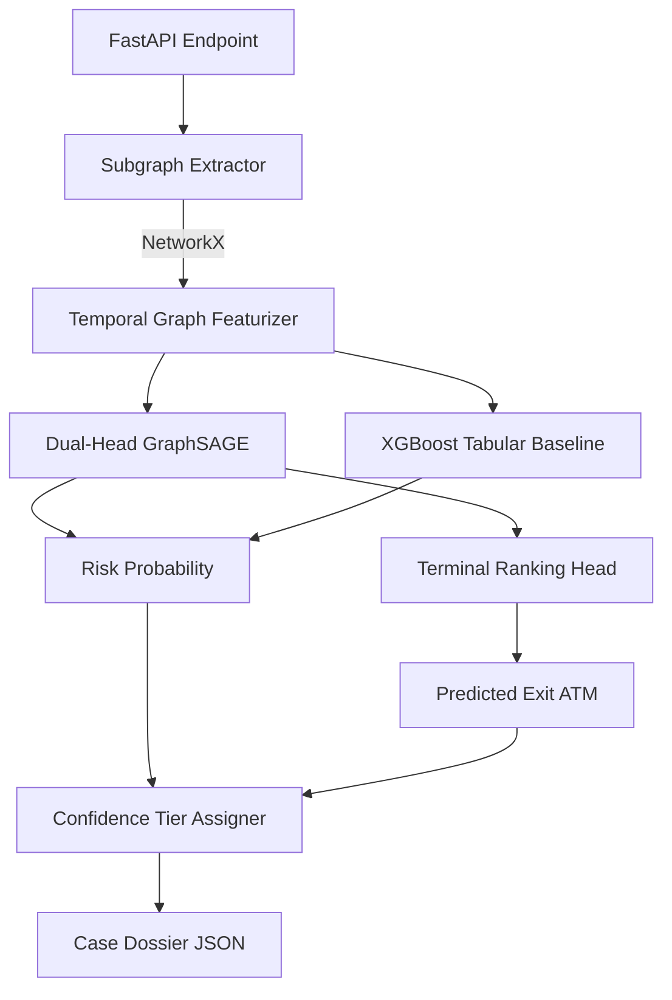

# sihmodel - Tritrinetraa ML Inference Engine

## Purpose
`sihmodel` is the core machine learning inference engine for the TRINETRAA platform. It receives graph topologies and transaction records, extracts contextual subgraphs, and evaluates them using a **Dual-Head GraphSAGE** (PyTorch Geometric) model and an **XGBoost** tabular baseline. It predicts the risk probability of complex multi-hop money laundering rings, identifies likely exit nodes (cash-out terminals), and generates human-readable confidence tiers (Explainable AI) for frontline officers.

## Tech Stack
- **Language**: Python 3.10+
- **API Framework**: FastAPI, Uvicorn, Pydantic
- **Machine Learning**: PyTorch (2.0+), PyTorch Geometric (`torch_geometric`), XGBoost, Scikit-Learn
- **Graph Processing**: NetworkX, Pandas, Numpy
- **Database Layer**: SQLAlchemy, SQLite (for mock/demo datasets)

## Folder Structure
- `src/`: Core Python modules for API and ML models.
  - `adapters/`: Logic to adapt synthetic/IBM datasets to the common GraphSAGE schema.
  - `graphsage_classifier.py` / `xgboost_baseline.py`: Core model definitions and forward passes.
  - `confidence_tiers.py`: Explainability logic translating raw logits into actionable officer briefs.
  - `streaming_engine.py`: Temporal transaction graph memory for live batch simulation.
  - `api.py`: FastAPI application routing and controllers.
- `models/`: Serialized model weights (`.pt`, `.json`).
- `data/`: SQLite databases containing the pre-seeded mock incidents (`sih_aml.db`).
- `simulations/`: Evaluation benchmark results and snapshot artifacts.

## Model Architecture


The architecture uses PyTorch Geometric for spatial-temporal graph embeddings (up to 3 hops) combined with XGBoost for robust tabular transaction statistics.

## Full API Reference

| Method | Path | Description | Request | Response Model |
|--------|------|-------------|---------|----------------|
| GET | `/api/health` | Service health & model load status. | - | `HealthResponse` |
| GET | `/api/stats` | Global ML stats (throughput, snapshot info). | - | *dict* |
| GET | `/api/incidents` | Ranked incident queue with ML risk scores. | `?page, size, min_risk` | `IncidentListResponse` |
| GET | `/api/incidents/{id}` | Detailed case dossier for a specific incident. | - | *dict* (Incident Dossier) |
| GET | `/api/incidents/{id}/graph` | Full 3D topology of the transaction ring. | - | `GraphStructureResponse` |
| GET | `/api/entities/locations` | Geo-coordinates for flagged terminals/ATMs. | - | *list* |
| POST | `/api/predict/subgraph` | Live on-the-fly inference for a seed entity. | `LivePredictRequest` | `LivePredictResponse` |
| POST | `/api/simulate/stream` | Batched streaming of live transactions. | `?dataset, num_tx` | *dict* |
| POST | `/api/policy/tune` | Dynamic evaluation of sweeping risk thresholds. | `?threshold, dataset` | `PolicyTuneResponse` |
| GET | `/api/dossier/{id}/export`| Markdown/HTML/JSON export of the dossier. | `?format` | `PlainTextResponse` |

## Data Layer (SQLite)
To support isolated, high-performance mock queries without waiting for complex Postgres joins, the engine uses a local SQLite database (`data/sih_aml.db`).
- **`entities_master`**: Accounts, mules, and terminals.
- **`transactions`**: The directed edges between entities.
- **`complaints`**: 1,000+ pre-seeded mock complaints used for the SIH demo.
- **`incident_predictions`**: Pre-computed GraphSAGE probabilities and confidence tiers.

## Confidence Tier Logic
Raw model logits (`0.0` - `1.0`) are transformed into Explainable AI tiers:
- **`HIGH_CONFIDENCE`**: `P(risk) >= 0.85` + at least 2 distinct supporting signals (e.g., known cash-out terminal matches + multi-hop topology).
- **`FIRST_TIME_RING_CANDIDATE`**: `P(risk) >= 0.85`, but structural similarity to known patterns is low (`sim < 0.75`), indicating a novel laundering technique.
- **`MEDIUM_CONFIDENCE`**: `0.70 <= P(risk) < 0.85` OR missing supporting terminal evidence.
- **`NORMAL`**: `P(risk) < 0.70`, standard transaction noise.

## Environment Variables
- *(Optional)* Set `PORT` to override the default Uvicorn port (`8080`).

## Local Development
Requires Python 3.10+.
```bash
# Create venv and install dependencies
python -m venv venv
source venv/bin/activate  # (or venv\Scripts\activate on Windows)
pip install -r requirements.txt

# Run the FastAPI server locally
python -m uvicorn src.api:app --host 0.0.0.0 --port 8080 --reload
```

## Deployment
Deployed via **Railway**. The repository includes configuration to run `uvicorn src.api:app` natively. The Railway health check targets `/api/health`.

## Known Limitations & Demo Considerations
**Database Isolation Issue**: For the SIH hackathon demo, this ML service operates entirely on its pre-seeded SQLite database (`sih_aml.db`). It does *not* connect to the PostgreSQL database managed by `sihback`. 
- Complaints filed via the frontend flow into Postgres, but because `sihmodel` does not read from Postgres, new complaints will not automatically appear in the Incident Queue fetched from `/api/incidents`.
- The live streaming endpoint (`/api/simulate/stream`) dynamically generates synthetic data in memory and scores it on the fly, demonstrating real-time capabilities without persisting to the database.

